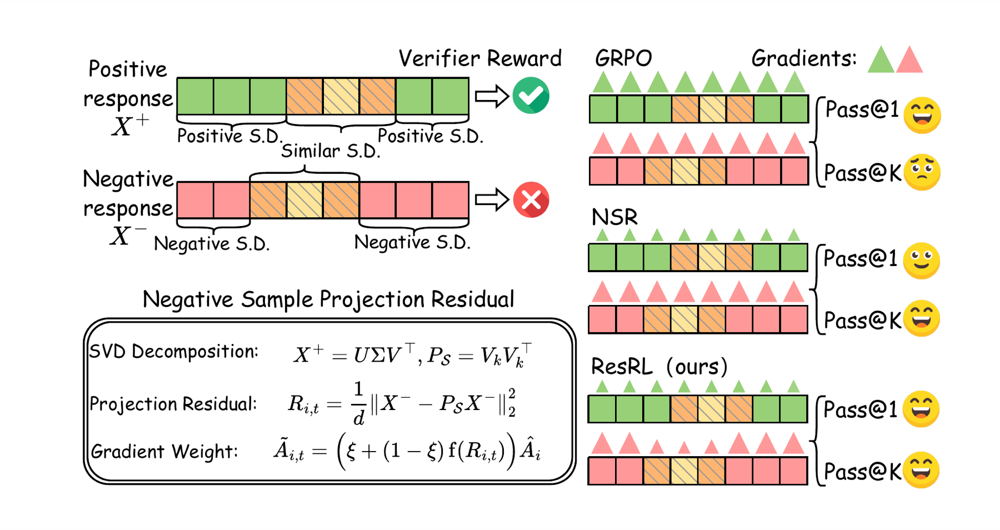
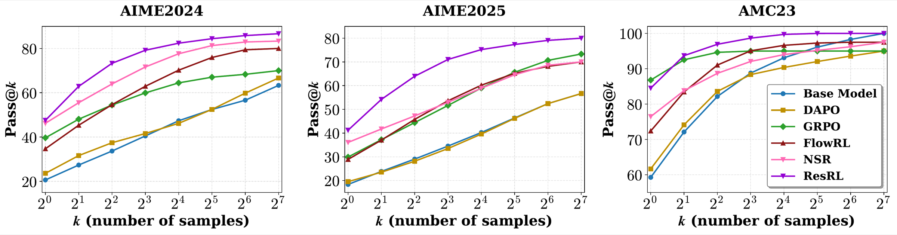

# ResRL: Residual Reinforcement Learning for LLM Reasoning

🧠 **ICML 2026** · 🚀 **RLVR / GRPO** · 📐 **Token-level negative-sample weighting**

This repository contains the training code for **ResRL: Boosting LLM Reasoning via Negative Sample Projection Residual Reinforcement Learning**. ResRL is built on top of `verl` and improves reinforcement learning from verifiable rewards by changing how failed rollouts are optimized: instead of treating every token in a negative response equally, it measures which negative tokens drift away from the successful reasoning subspace and weights their policy gradients more strongly.

## What ResRL Does

In standard GRPO-style RLVR, each generated response receives a sequence-level reward. That is simple and scalable, but for negative samples it gives the same advantage to every token, including tokens that may still be useful reasoning steps.

ResRL adds a token-level signal for negative samples:

1. ✅ Collect positive rollouts for the same prompt.
2. 📐 Build a low-rank positive reasoning subspace from their penultimate-layer hidden states.
3. ❌ Project each token hidden state from negative rollouts onto that subspace.
4. 📏 Use the orthogonal residual distance as a token-level error score.
5. ⚖️ Normalize residuals within the prompt group and use them to reweight negative advantages.

Positive samples are still kept, but their advantages are down-scaled with a small constant. In the paper setting this value is `0.1`.



## Paper Highlights

Paper-reported results show that ResRL improves reasoning across several RLVR settings:

| Setting | Representative result |
| --- | --- |
| 🧮 Math reasoning | Qwen3-4B reaches **57.0 Avg@16** across the reported math benchmark suite. |
| 💻 Code reasoning | Qwen3-4B reaches **1469.5 CodeForces rating** in the reported code setting. |
| 🧭 Agent tasks | ResRL reports **86.7** success on ALFWorld. |
| 🧩 Function calling | ResRL reports **41.25** on BFCL multi-turn overall accuracy. |



The implementation in this repository follows the ResRL actor-side algorithm and paper-aligned math training setup.

## Repository Map

```text
.
├── train_command.sh                         # Paper-aligned math training entry point
├── verl/workers/actor/dp_actor.py           # ResRL token weighting implementation
├── verl/workers/reward_manager/naive.py     # Verifiable reward + length-scaled positive reward
├── verl/trainer/config/actor/actor.yaml     # ResRL actor config defaults
├── examples/                                # Upstream verl examples
├── recipe/                                  # Upstream verl recipes
└── docs/                                    # Upstream verl documentation
```

## Install

This codebase is built on [`verl-0.5.0`](https://github.com/volcengine/verl/tree/v0.5.0). Use a CUDA environment compatible with your PyTorch, FlashAttention, and vLLM stack, then install this repository in editable mode:

```bash
conda create -n resrl python=3.10 -y
conda activate resrl

pip install -e .
pip install -r requirements.txt
```

## Data Format

`train_command.sh` expects parquet files:

```bash
TRAIN_FILES=/data/dapo-math-17k.parquet
VAL_FILES=/data/validation.parquet
```

Training and test data preparation follows the public [FlowRL data pipeline](https://github.com/Xuekai-Zhu/FlowRL#step-2-data-preparation).

The data should follow the usual `verl` GRPO/RLVR format:

| Field | Purpose |
| --- | --- |
| `prompt` | Input problem or conversation. |
| `reward_model` / answer metadata | Used by the reward function to verify correctness. |
| `data_source` | Selects the reward scoring function. |
| `uid` | Prompt identifier. ResRL uses this to group rollouts from the same prompt. |

`uid` is strongly recommended. If it is missing, the actor falls back to contiguous groups of size `rollout_n`, so the batch must preserve rollout order exactly.

## Quick Start

The default script follows the main math training setup from the paper:

```bash
bash train_command.sh
```

Common overrides:

```bash
PRETRAINED_MODEL=Qwen/Qwen3-1.7B \
TRAIN_FILES=/path/to/train.parquet \
VAL_FILES=/path/to/val.parquet \
OUTPUT_DIR=/path/to/checkpoints/resrl-qwen3-1.7b \
bash train_command.sh
```

For smaller local smoke tests, reduce the batch size and tensor parallel size:

```bash
PRETRAINED_MODEL=Qwen/Qwen3-1.7B \
TRAIN_BATCH_SIZE=16 \
PPO_MINI_BATCH_SIZE=4 \
N_GPUS_PER_NODE=1 \
TENSOR_MODEL_PARALLEL_SIZE=1 \
bash train_command.sh trainer.total_epochs=1 trainer.test_freq=-1
```

## Paper-Aligned Defaults

| Component | Default in this repo |
| --- | --- |
| Algorithm | `GRPO` |
| Base model | `Qwen/Qwen3-4B` by default; override for 1.7B or 8B runs |
| Train batch size | `256` |
| PPO mini batch size | `64` |
| Rollouts per prompt | `4` |
| Max prompt / response length | `2048 / 4096` |
| Learning rate | `1e-6` |
| LR warmup steps | `10` |
| Weight decay | `0.1` |
| KL reward | disabled |
| Actor KL loss coefficient | `0.0` |
| Entropy coefficient | `0` |
| Remove padding | enabled |
| Dynamic batch size | disabled |
| Tensor parallel size | `8` |
| Rollout temperature / top-p / top-k | `0.6 / 1.0 / -1` |

## ResRL-Specific Config

The core switches live under `actor_rollout_ref.actor`:

| Config | Default | Meaning |
| --- | ---: | --- |
| `use_svd_token_weighting` | `true` in `train_command.sh` | Enables ResRL. |
| `svd_rank` | `64` | Rank of the positive reasoning subspace. |
| `svd_max_pos_tokens` | `4096` | Uniformly sampled positive tokens per prompt group for PCA. |
| `svd_q_low` / `svd_q_high` | `0.2 / 0.8` | Quantiles for residual normalization. |
| `svd_min_weight` | `0.1` | Lower bound for negative-token weights. |
| `svd_pos_weight` | `0.1` | Positive-sample advantage multiplier. |
| `svd_pca_niter` | `4` | Power iterations for `torch.pca_lowrank`. |

The actor computes ResRL weights in `verl/workers/actor/dp_actor.py` from the model's penultimate hidden layer. It layer-normalizes hidden states, centers by the positive-token centroid, builds the low-rank basis with `torch.pca_lowrank`, and maps each valid negative token residual to a weight in `[svd_min_weight, 1.0]`.

## Length-Scaled Rewards

The paper keeps positive rewards unchanged up to 3500 response tokens and linearly decays them to 70% at 4096 tokens. This is implemented in `verl/workers/reward_manager/naive.py` and enabled by default in `train_command.sh`:

```bash
export VERL_ENABLE_LENGTH_PENALTY=true
export MAX_RESPONSE_LENGTH=4096
export LENGTH_PENALTY_START=3500
export LENGTH_PENALTY_END_SCALE=0.7
```

Negative rewards are not length-penalized.

## Evaluation

Training-time validation is controlled by:

```bash
VAL_ROLLOUT_N=1
ROLLOUT_TEMPERATURE=0.6
ROLLOUT_TOP_P=1.0
ROLLOUT_TOP_K=-1
```

Benchmark testing follows the public [FlowRL testing protocol](https://github.com/Xuekai-Zhu/FlowRL#testing).

## Citation

```bibtex
@inproceedings{lin2026resrl,
  title={ResRL: Boosting LLM Reasoning via Negative Sample Projection Residual Reinforcement Learning},
  author={Zihan Lin and Xiaohan Wang and Jie Cao and Jiajun Chai and Li Wang and Xiaodong Lu and Wei Lin and Ran He and Guojun Yin},
  booktitle={Proceedings of the International Conference on Machine Learning},
  year={2026}
}
```

## Acknowledgements

This codebase builds on `verl` / HybridFlow and its GRPO training infrastructure.
